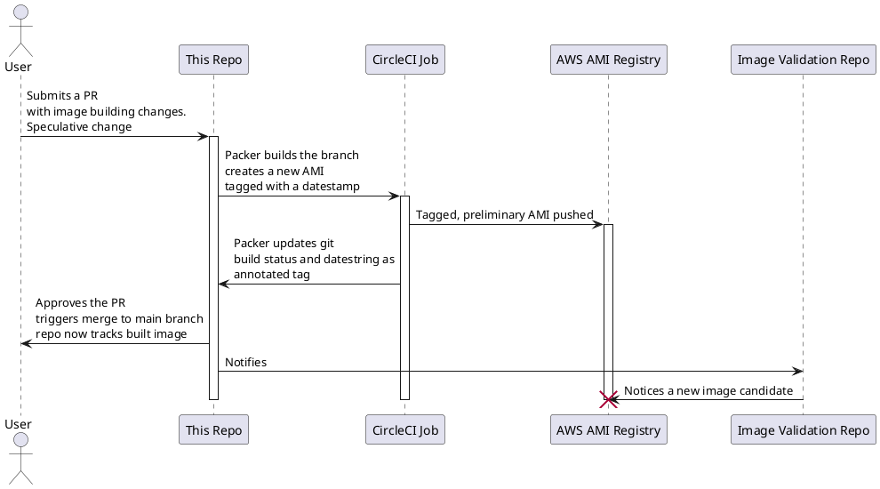

## CircleCI driving Packer to validate and refresh custom AMIs

You need a standard image to base things on. Maybe one with some configuration management
installed and pre-converged to improve later machine creation-till-ready delays which can slow
effective ASG usage. Maybe as a start at tooling establishing immutable builds.

This same repo and CircleCI structure could build container images, vSphere templates, packer
has a ton of output formats. 

Run this on demand (as a PR proposing changes to policy inside this repo) OR run on a schedule
as part of your patching strategy.  Images will be built, packages updated, policy re-converged,
then given a basic once-over smoke test for sanity before upload to the AMI
Registry with a unique tag per run. Once validated further

Scheduled runs managed by CircleCI could vary anywhere from daily to weekly, incorporate some
 form of acceptance testing and be confident that you're basing builds off of a generally 
current, pre-baked AMI that's undergone some inspection and testing. 

### Secrets
We only need AWS creds for this. I've created a minimally permissioned unique set that can only:
* ability to manipulate some ec2 instances
* ability to manipulate AMI tags

### References
* https://github.com/CircleCI-Public/circleci-packer
* https://gist.github.com/irgeek/2f5bb964e3ce298e15b7


I'd like to make this a bit more GitOps single-source of truth by having two jobs acting on 
this repo reflect both the desired state (the packer directives) and the dependency-resolved 




#### tips
to get data out of the packer output
```
packer build -machine-readable packer.json | tee build.log
grep 'artifact,0,id' build.log | cut -d, -f6 | cut -d: -f2
```